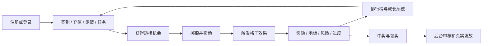
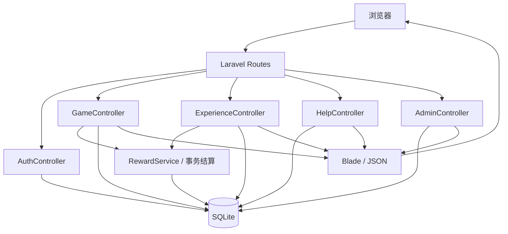

# 幸运跳棋大冒险：从 0 到 1 项目讲解手册

> 面向第一次接触项目的产品、研发、测试和运营同事。建议先通读本文建立全局认识，再按文末索引查看专项文档。

## 1. 一句话理解项目

这是一个需要登录的营销活动系统：用户通过签到、充值、邀请和任务获得掷骰机会，在 36 格大富翁棋盘上移动、触发奖励或风险、收集地标并参与排行榜；运营人员通过后台管理活动、充值、任务和奖品发放。

项目不是传统的棋牌游戏。棋盘是承载用户增长任务、奖励反馈和排行榜竞争的活动载体。

## 2. 为什么做这个项目

项目围绕四个业务目标设计：

1. 用连续签到和每日、每周任务提高活跃与留存。
2. 用本人充值和好友首充奖励促进付费转化。
3. 用邀请注册、邀请记录和邀请榜促进用户传播。
4. 用棋盘奖励、地标收集和排行榜大奖形成持续参与动力。

核心闭环如下：



## 3. 当前交付范围

### 3.1 用户端

- 注册、登录、退出和邀请码注册。
- 活动首页、36 格棋盘、立体骰子和走棋反馈。
- 连续签到、本人充值、邀请注册及好友首充奖励。
- 每日和每周任务、圈数宝箱、地标宝箱。
- 地标图鉴、幸运值、道具、成就、棋子皮肤和赛季阶段。
- 机会明细、中奖记录、中奖惊喜提示和消息中心。
- 总进度榜、今日活跃榜和邀请榜。
- 奖池、个人领奖资料提交和领奖进度。
- 新手引导、格子说明、完整玩法说明和 FAQ。
- PC 与手机响应式页面。

### 3.2 运营后台

- 活动时间、状态和充值机会日上限配置。
- 人工充值记账、用户机会补发或扣回。
- 默认 6 个任务的启用和停用。
- 用户机会、圈数、位置、VIP 和电池查询。
- 统一奖品发放队列及领奖资料审核。
- 运营操作审计日志。

### 3.3 当前不是生产完整版的部分

- 充值使用后台人工记账模拟支付成功，生产环境需要接入带签名验证的支付回调。
- 排行榜为请求时查询，不使用 WebSocket；小访问量场景足够。
- 项目没有真实短信、邮件、物流和链上转账集成。
- 奖品“已发放”表示运营确认完成，系统本身不会替代真实打款或寄送。

## 4. 角色与入口

| 角色 | 主要职责 | 入口 |
| --- | --- | --- |
| 普通用户 | 获取机会、走棋、完成成长目标、查看榜单、提交领奖资料 | `/activity`、`/activity/center`、`/activity/help` |
| 管理员 | 配置活动、记账、调整机会、管理任务、处理奖品 | `/admin` |

本地种子数据提供演示账号：

| 角色 | 邮箱 | 密码 |
| --- | --- | --- |
| 用户 | `demo@example.com` | `Demo123!` |
| 管理员 | `admin@example.com` | `Admin123!` |

演示账号只适用于本地或受控演示环境，正式部署必须修改或删除。

## 5. 用户从 0 到 1 的完整旅程

### 5.1 注册和进入活动

用户可以直接注册，也可以携带邀请人的邀请码注册。注册成功后会建立用户活动状态；有效邀请只给邀请人发放一次注册奖励。

### 5.2 获得跳棋机会

系统中的“机会”相当于走棋次数，所有增减都会写入机会流水。

| 来源 | 规则 |
| --- | --- |
| 连续签到 | 普通签到 5 次；连续第 7、14 天为 10 次；中断后从第 1 天重新计算 |
| 本人充值 | 每累计达到 10 USDT 获得 10 次，受每日充值机会上限约束 |
| 邀请注册 | 每位有效好友给邀请人 5 次，只发一次 |
| 好友首充 | 好友首次累计达到 10 USDT 时给邀请人 10 次，后续充值不重复奖励 |
| 每日/每周任务 | 达标后手动领取配置的机会奖励 |
| 棋盘与成长系统 | 机会格、圈数宝箱、地标宝箱和成就也可能发放机会 |

每次机会变化都记录类型、业务唯一键、变化数量、变化后余额和说明，便于幂等控制与客服核查。

### 5.3 掷骰和走棋

用户点击中央立体骰子后，正常情况下消耗 1 次机会并产生 1～6 点。服务端完成随机数、移动、格子结算和记录落库，前端只负责动画和展示，不能自行决定点数或奖励。

如果用户处于冰冻状态，本次点击会消耗 1 次机会解冻，但不移动。炸弹会把用户送回当前圈起点，不清除已经完成的圈数。

### 5.4 棋盘格类型

36 格棋盘采用大富翁式环形布局，主要分为：

- 安全格：不产生数值效果，用于调节节奏。
- 地标格：紫色标记，首次到达解锁印章和专属效果，重复到达转化为幸运值。
- 前进或后退格：改变最终位置。
- 机会、电池、VIP 和现金奖励格：发放对应奖励或生成中奖记录。
- 冰冻和炸弹格：产生风险状态。

事件位移后的最终落点会结算地标进度；不会无限连锁触发其他位移、奖励或风险效果。

### 5.5 成长与竞争

用户的长期目标包括完成圈数、解锁地标、积累幸运值、领取里程碑、获得道具与成就、解锁棋子皮肤，以及冲击排行榜。

总进度榜排序依次比较：

1. 完成圈数更多者优先。
2. 当前格子更靠前者优先。
3. 到达当前进度时间更早者优先。

页面展示前 20 名，最终奖励为：

| 名次 | 奖励 |
| --- | --- |
| 第 1 名 | iPhone 17 Pro |
| 第 2 名 | 500 USDT |
| 第 3 名 | 400 USDT |
| 第 4 名 | 300 USDT |
| 第 5 名 | 200 USDT |
| 第 6～10 名 | 每人 100 USDT |

### 5.6 中奖和领奖

自动到账的 VIP、电池等奖励可以直接标记已发放。需要钱包、银行、本地支付或实物配送资料的奖品会生成待发放记录。

领奖流程为：

```text
中奖 → 等待用户提交资料 → 已提交 → 审核中 → 发放中 → 已发放
                                               └→ 已驳回
```

管理员后台以中奖记录为统一队列。用户未提交资料时仍能看到记录；无需资料的奖品可以直接发放。涉及资金或实物时，管理员应先完成真实打款或寄送，再更新系统状态。

## 6. 技术架构

### 6.1 当前技术栈

| 层级 | 技术 |
| --- | --- |
| 运行环境 | PHP 8.2+ |
| 后端框架 | Laravel 12 |
| 数据库 | SQLite |
| 模板 | Blade |
| 前端 | 原生 JavaScript、CSS、Vite 7 |
| 后端测试 | PHPUnit 11 |
| 前端测试 | Node.js 内置测试运行器 |
| 代码格式 | Laravel Pint |

注意：早期方案讨论过 PHP 7.4 和 Laravel 8，但当前仓库已经实现为 PHP 8.2+ 和 Laravel 12，应以 `composer.json` 为准。

### 6.2 请求架构



控制器负责身份校验、参数验证和业务编排；关键奖励通过服务或数据库事务写入；Blade 输出首屏 HTML，走棋和记录分页使用 JSON；前端脚本负责骰子动画、弹框、音效、格子说明和增量加载。

## 7. 代码目录怎么读

| 路径 | 作用 | 新同事建议阅读顺序 |
| --- | --- | --- |
| `routes/web.php` | 所有页面和操作路由 | 第 1 个看，先建立入口地图 |
| `app/Http/Controllers/GameController.php` | 活动首页、签到、走棋、记录和榜单 | 第 2 个看，理解主业务 |
| `app/Http/Controllers/ExperienceController.php` | 任务、宝箱、道具、皮肤和领奖 | 第 3 个看，理解成长系统 |
| `app/Http/Controllers/AdminController.php` | 后台运营操作 | 理解管理闭环 |
| `app/Services/RewardService.php` | 统一奖励发放 | 理解奖励如何安全落库 |
| `database/migrations/` | 表结构和旧库升级补偿 | 理解数据模型与兼容策略 |
| `database/seeders/DatabaseSeeder.php` | 演示活动、棋盘和规则数据 | 快速了解默认配置 |
| `resources/views/` | Blade 页面结构 | 按 `game`、`experience`、`admin` 阅读 |
| `resources/js/` | 前端交互和反馈 | 重点看走棋反馈与任务记录模块 |
| `resources/css/app.css` | 全站视觉、响应式和动效 | 修改界面前先了解现有设计系统 |
| `tests/Feature/` | 业务回归测试 | 通过测试理解边界条件 |
| `tests/js/` | 前端逻辑测试 | 理解反馈和浮层定位规则 |

## 8. 数据模型

项目使用关系表而不是把全部状态塞进一个 JSON。可以按业务域理解。

### 8.1 活动和棋盘

- `activities`：活动时间、时区、状态、启用状态和充值机会日上限。
- `activity_users`：用户在活动中的机会、圈数、位置、冻结状态、充值累计和幸运值。
- `board_cells`：36 个格子的类型、位置、图标、数值、分类、地标代码和效果。
- `board_moves`：每次走棋的起止位置、骰子、结算结果和结构化反馈。

### 8.2 机会、签到、充值和邀请

- `chance_transactions`：不可缺少的机会流水和业务幂等凭据。
- `checkins`：签到日期、连续天数和发放数量。
- `recharge_orders`：充值订单、金额和发放机会。
- `invitation_rewards`：邀请关系、注册奖励和好友首充奖励是否已发。

### 8.3 成长系统

- `task_definitions`、`user_task_progress`：任务定义和分周期领取记录。
- `milestone_definitions`、`user_milestones`：圈数宝箱和领取记录。
- `user_landmarks`、`landmark_reward_definitions`、`user_landmark_rewards`：地标访问、阶段宝箱和领取记录。
- `item_definitions`、`user_items`、`user_active_effects`：道具定义、库存和生效中的效果。
- `achievement_definitions`、`user_achievements`：成就定义和用户解锁状态。
- `skin_definitions`、`user_skins`：棋子皮肤定义和用户拥有关系。

### 8.4 中奖和运营

- `winning_records`：中奖事实及当前发放状态。
- `prize_claims`：用户提交的领奖方式、资料、审核状态和备注。
- `activity_messages`：站内活动消息。
- `admin_audit_logs`：管理员操作、对象、数据和 IP。

## 9. 四条最重要的数据流

### 9.1 走棋事务

1. 客户端生成 UUID `request_id` 并提交。
2. 服务端先按 `request_id` 查询历史走棋，重复请求直接返回原结果。
3. 校验活动时间、状态和用户机会。
4. 在数据库事务中扣除机会、生成点数、应用道具、计算圈数和位置。
5. 结算最终格子、奖励、地标、幸运值或风险。
6. 写入走棋记录、机会流水、中奖记录和消息。
7. 返回结构化结算，前端统一展示点数、最终位置、变化项和余额。

`request_id` 和机会流水的业务键共同防止用户双击或网络重试造成重复扣费、重复奖励。

### 9.2 充值和邀请奖励

1. 后台记录一笔充值金额。
2. 系统更新用户累计充值金额。
3. 每跨过一个 10 USDT 档位，给本人发放 10 次机会，并受当日上限限制。
4. 如果该用户是被邀请人，且首次累计达到 10 USDT，则给邀请人发放一次 10 次机会。
5. 写入充值订单、机会流水和邀请消息。

生产接支付平台时应保留第 2～5 步，只替换第 1 步的可信输入来源。

### 9.3 任务领取

1. 任务定义说明周期、指标、目标和奖励。
2. 页面打开时根据签到、走棋、圈数、充值或邀请数据实时计算进度。
3. 用户达标后主动领取。
4. `user_task_progress` 以任务、用户和周期键防止重复领取。
5. `RewardService` 发放奖励并生成对应流水。

旧数据库通过幂等迁移补齐默认 6 个任务，不覆盖管理员已经修改的配置。

### 9.4 领奖和发放

1. 中奖先写入 `winning_records`。
2. 需要资料时，用户在幸运中心提交并写入 `prize_claims`。
3. 后台以中奖记录左连接领奖申请，因此未提交和已提交记录都可见。
4. 管理员更新审核状态；标记已发放时同步更新中奖状态。
5. 用户活动页和幸运中心显示最新状态。

## 10. 为什么当前使用 SQLite

对当前访问量不大的单机活动，SQLite 合适：部署简单、无需独立数据库服务、备份就是安全复制数据库文件，事务也能保证关键结算一致性。

必须遵守以下约束：

- Web 服务用户需要拥有数据库文件和所在目录的写权限。
- 开启 WAL 和合理的 busy timeout，减少读写互相阻塞。
- 备份时使用 SQLite 安全备份方式，不能在高频写入时随意复制半写入文件。
- 不要把多台应用服务器同时连接同一个网络文件系统上的 SQLite。
- 当并发写入、数据量、报表或高可用需求明显上升时，迁移到 MySQL 或 PostgreSQL。

## 11. 本地从零启动

### 11.1 环境要求

- PHP 8.2 或更高版本。
- Composer 2。
- Node.js 20 或更高版本及 npm。
- PHP 扩展：PDO、SQLite、Mbstring、OpenSSL、Tokenizer、XML、Ctype、JSON。

### 11.2 安装命令

```bash
git clone git@github.com:tiffany0205/newfuweng.git
cd newfuweng
cp .env.example .env
composer install
php artisan key:generate
touch database/database.sqlite
php artisan migrate:fresh --seed
npm install
npm run build
php artisan serve
```

本地访问地址通常为：

```text
http://127.0.0.1:8000
```

`migrate:fresh --seed` 会清空数据库，只允许用于本地或明确可重建的环境。已有环境升级使用：

```bash
php artisan migrate --force
```

## 12. 测试和质量检查

提交代码前至少运行：

```bash
php vendor/bin/phpunit
npm run test:js
vendor/bin/pint --test
npm run build
composer audit
git diff --check
```

测试重点包括：

- 登录身份和管理员权限。
- 签到连续性与防重复。
- 走棋事务、幂等和格子效果。
- 地标升级兼容与幸运值。
- 任务、宝箱、道具和领奖只能领取一次。
- 排行榜顺序和位置显示。
- 用户数据隔离、游标分页和安全 DOM 渲染。
- 旧 SQLite 数据库执行新迁移后的兼容性。

## 13. 部署和更新的最短路径

首次生产部署需要配置 PHP-FPM、Nginx、HTTPS、SQLite 权限、环境变量和前端构建。完整步骤见[部署文档](deployment.md)。

常规更新可以概括为：

```bash
git pull origin main
composer install --no-dev --optimize-autoloader
php artisan migrate --force
npm ci
npm run build
php artisan optimize:clear
php artisan config:cache
php artisan route:cache
php artisan view:cache
```

更新前先备份 `.env` 和 SQLite 数据库。部署成功后的实际访问地址由服务器域名和 `APP_URL` 决定，仓库无法自动知道线上域名。

## 14. 日常运营怎么用

管理员每天重点检查：

1. 活动状态与结束时间是否正确。
2. 充值补单和机会流水是否一致。
3. 待提交、审核中和发放中的奖品。
4. 排行榜异常进度、异常充值或邀请行为。
5. `storage/logs/laravel.log`、磁盘空间和 SQLite 备份。

任务管理用于临时关闭不适合当前阶段的任务。停用后用户无法看到或领取对应任务，历史记录不会删除。

## 15. 安全与风险边界

- 所有奖励和位置必须由服务端计算，不能相信前端值。
- 充值回调必须验签，并用支付订单号做幂等。
- 领奖资料可能包含钱包、账户或地址，必须限制管理员权限、日志输出和保存期限。
- 管理员操作应保留审计记录，关键派奖还应有人工复核。
- 正式环境关闭调试：`APP_DEBUG=false`。
- 排行榜大奖发放前需要额外做账号、设备、IP、充值和邀请风控。
- SQLite 适合当前小规模场景，但不等于无需监控和备份。

## 16. 给同事讲解时的推荐顺序

一场 45～60 分钟的项目介绍可以这样安排：

| 时间 | 内容 | 演示建议 |
| --- | --- | --- |
| 5 分钟 | 活动目标与核心闭环 | 讲清“任务获得机会—走棋—成长—领奖” |
| 10 分钟 | 用户完整旅程 | 用户登录、签到、掷骰、看记录和榜单 |
| 10 分钟 | 棋盘、地标和奖励规则 | 演示格子说明、走棋弹框和幸运中心 |
| 10 分钟 | 技术架构和核心数据流 | 重点讲走棋事务、幂等和奖励流水 |
| 10 分钟 | 运营后台 | 演示充值、任务管理和奖品发放管理 |
| 5 分钟 | 部署、测试和风险 | 说明 SQLite、支付边界和测试命令 |
| 5～10 分钟 | 提问 | 根据岗位进入专项文档 |

讲解时建议同时打开四个页面：`/activity`、`/activity/center`、`/activity/help` 和 `/admin`。先讲用户看到什么，再解释代码如何实现，比从数据库表开始更容易理解。

## 17. 新同事接手检查清单

- [ ] 能在本地完成安装并用两个演示账号登录。
- [ ] 能说明机会的主要来源和防重复方式。
- [ ] 能从路由定位到走棋、任务领取和领奖处理代码。
- [ ] 能解释 `activity_users`、`board_moves`、`chance_transactions` 和 `winning_records` 的职责。
- [ ] 能运行完整测试和生产构建。
- [ ] 知道生产更新不能执行 `migrate:fresh`。
- [ ] 知道人工充值只是模拟入口，生产必须接支付回调。
- [ ] 知道奖品标记已发放前必须完成真实打款或寄送。
- [ ] 知道 SQLite 的使用边界和备份要求。

## 18. 文档导航

- 想理解完整产品规则：[活动设计方案](lucky-checkers-activity-plan.md)
- 想逐项查看现有功能：[功能说明手册](features-manual.md)
- 想安装或发布服务器：[部署文档](deployment.md)
- 想学习用户和管理员操作：[操作手册](operation-manual.md)
- 想了解 AI 参与和验证记录：[AI 使用记录](ai-usage-log.md)

## 19. 最后记住三件事

1. 机会流水、走棋记录和业务唯一键是活动资产正确性的基础。
2. 棋盘只是表现层，真正的业务闭环是活跃、充值、邀请、成长和领奖。
3. 当前版本适合小访问量单机活动；接入真实支付和大额派奖前，必须补齐支付验签、风控、隐私和运维能力。
